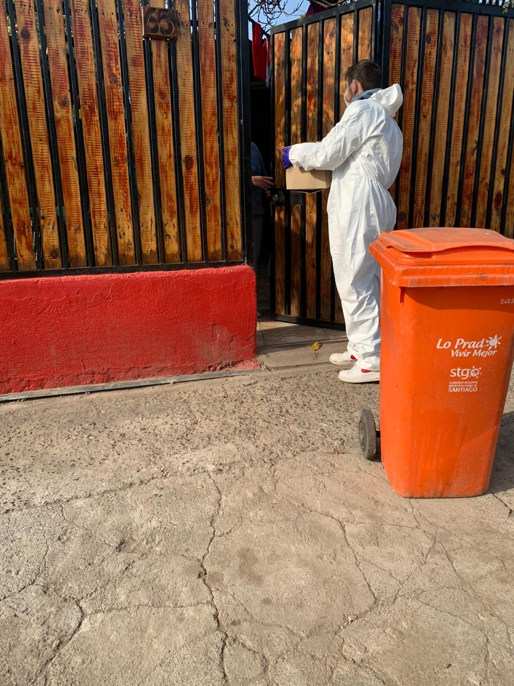

### Somos un grupo de jóvenes cristianos que anhelan incansablemente la justicia social soñada por Jesús de Nazaret hace dos mil años.

*Misión: servir a las familias del sector poniente de la capital mediante un plan de trabajo integral, con el fin de combatir el virus de la pobreza que sufren nuestros hermanos y hermanas.*

# ¿Cómo lo haremos?

A tráves de la entrega de mercadería, organización de ollas comunes, desayuno y once comunitarias.

---

Síguenos en redes sociales

## [Facebook](https://www.facebook.com/Parroquia-Cristo-de-Ema%C3%BAs-90180038266)

## [Instagram](https://instagram.com/granitos_de_mostazas?igshid=18tbl1w6vdv02)

{width=640 height=400}

{width=640 height=352}

# Ayúdanos a combatir el virus de la pobreza!