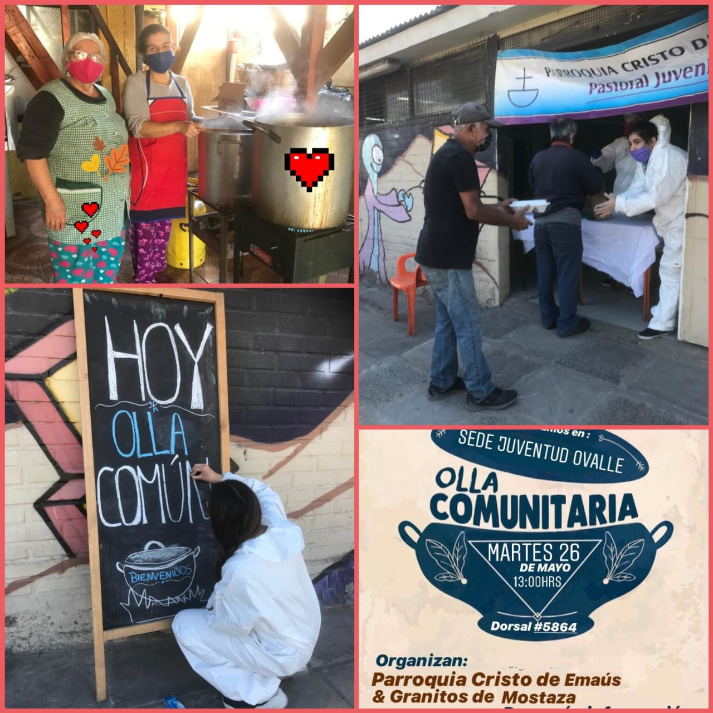

## Somos un grupo de jóvenes cristianos que anhelan incansablemente la justicia social soñada por Jesús de Nazaret hace dos mil años atrás.

*Misión: ayudar sistemáticamente a las familias del sector poniente de la capital mediante un plan de trabajo continuo, con el objetivo de combatir el virus de la pobreza que sufren nuestros hermanos. De esta forma, nos entregaremos como templo donado para servir donde el Señor lo requiera*

---

Siguenos en redes sociales

## [Facebook](https://www.facebook.com/Parroquia-Cristo-de-Ema%C3%BAs-90180038266)

## [Instagram](https://instagram.com/granitos_de_mostazas?igshid=18tbl1w6vdv02)

# Ayúdanos a combatir el virus de la pobreza!