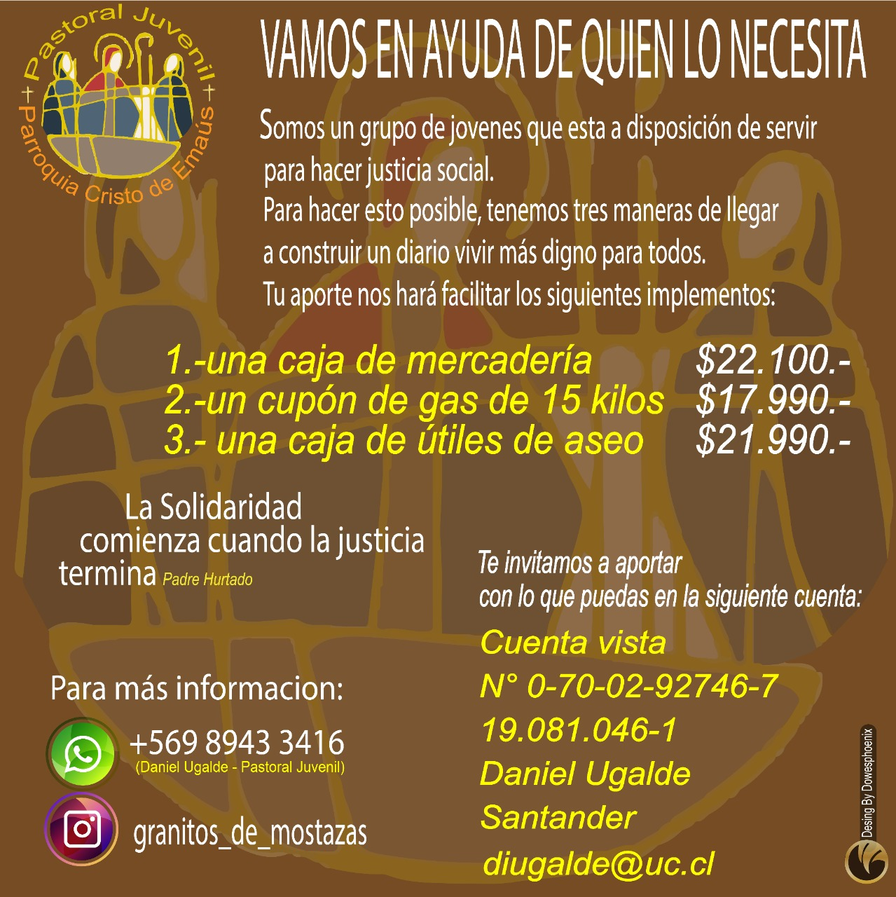

Pastoral juvenil P. Cristo de Emaús

# ¡Bienvenidos a esta campaña que busca conseguir un poco de **Justicia y Dignidad** a nuestros hermanos y hermanas que están sufriendo los estragos de la pandemia!

---

### Para comenzar te invitamos a compartir este afiche para que juntos podamos ayudar a más familias!

---

# ¿Por qué "Granitos de Mostaza"?

### **Porque queremos ser una pequeña semilla de amor que crece gracias al servicio mancomunado de hombres y mujeres de buena voluntad que buscan dignificar la vida humana conferida por Dios mismo.**

